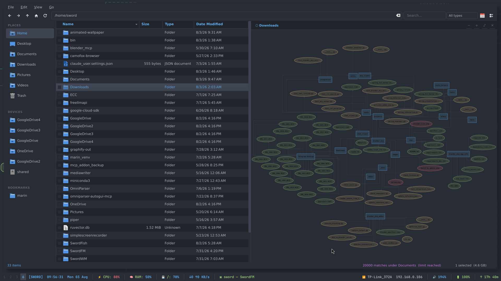
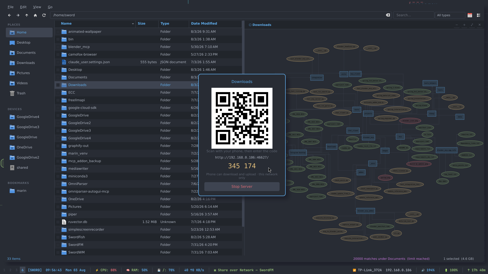

# SwordFM

A Thunar-like file manager built from scratch in C++20 with Qt6. One Dark theme, rclone cloud mounts, live preview panel, and full keyboard navigation.





---

## Included Tools

Every release package bundles all four — no separate downloads.

| Tool | What it does |
|------|-------------|
| `swordfm` | The file manager |
| `swordshare` | Password-protected LAN file sharing with QR code |
| `swordgraph` | Visualize folder structure as an interactive graph |
| `swordconv` | Document conversion — PDF, DOCX, MD, TXT, HTML |

---

## Dependencies

Every feature of SwordFM and its tools requires the following. The install commands in each option below cover all of them.

| Dependency | Used by | Notes |
|---|---|---|
| Qt6 (Widgets, Core) | `swordfm` | Core UI framework |
| `poppler-utils` | Preview panel | PDF preview (`pdftoppm`) |
| `tar`, `gzip`, `xz`, `bzip2`, `zstd` | Archive ops | Compress / extract tarballs |
| `zip` / `unzip` | Archive ops | ZIP support |
| `p7zip` / `7zip` | Archive ops | 7z and fallback ZIP/RAR |
| `unrar` | Archive ops | RAR extraction (optional) |
| `graphviz` | `swordgraph` | Renders folder graphs (`neato`) |
| `python3` + `pip` | `swordconv`, `swordshare`, `swordgraph` | All three helper tools |
| `pymupdf` (pip) | `swordconv` | Read/write PDF |
| `mammoth` (pip) | `swordconv` | Read DOCX files |
| `python-docx` (pip) | `swordconv` | Write DOCX files |
| `pdf2docx` (pip) | `swordconv` | PDF → DOCX with layout |
| `beautifulsoup4` (pip) | `swordconv` | HTML parsing |
| `markdown` (pip) | `swordconv` | Markdown rendering (optional, has built-in fallback) |
| `qrcode` (pip) | `swordshare` | QR code generation (optional) |
| A terminal emulator | `swordfm` F4 key | Any one: ghostty, kitty, alacritty, wezterm, foot, konsole, xfce4-terminal, gnome-terminal, or xterm |

---

## Installation

Pick **one** option below. Each installs all four tools and every dependency.

### Option 1: .deb package (Ubuntu / Debian / Kali)

```bash
wget https://github.com/BayazidHabibSiddikee/SwordFM/releases/download/v1.0.0/swordfm-1.0.0-amd64.deb
sudo dpkg -i swordfm-1.0.0-amd64.deb
sudo apt-get install -f -y
swordfm
```

That's it. `apt-get install -f` resolves all system packages, and the post-install script automatically runs `pip install` for all Python dependencies (`pymupdf`, `mammoth`, `python-docx`, `pdf2docx`, `beautifulsoup4`, `markdown`, `qrcode`). Everything is handled — no manual steps.

This installs `swordfm`, `swordshare`, `swordgraph`, and `swordconv` to `/usr/bin/`.

> **Qt version note:** The .deb was built against Qt 6.11. If `libqt6widgets6` can't
> be satisfied on your repos, use Option 2 or Option 3 instead — both work with any Qt6 version.

---

### Option 2: Portable tarball (any Linux, recommended if .deb fails)

```bash
wget https://github.com/BayazidHabibSiddikee/SwordFM/releases/download/v1.0.0/swordfm-1.0.0-linux-x64.tar.gz
tar xzf swordfm-1.0.0-linux-x64.tar.gz
cd SwordFM
```

Install all dependencies for your distro, then run `./install.sh`:

**Ubuntu / Debian / Kali**
```bash
sudo apt install -y \
  libqt6widgets6 libqt6core6 \
  poppler-utils \
  tar gzip xz-utils bzip2 zstd \
  zip unzip p7zip-full unrar \
  graphviz \
  python3 python3-pip

pip install pymupdf mammoth python-docx pdf2docx beautifulsoup4 markdown qrcode

./install.sh
```

**Arch**
```bash
sudo pacman -S --needed \
  qt6-base \
  poppler \
  tar gzip xz bzip2 zstd \
  zip unzip p7zip unrar \
  graphviz \
  python python-pip

pip install pymupdf mammoth python-docx pdf2docx beautifulsoup4 markdown qrcode

./install.sh
```

**Fedora**
```bash
sudo dnf install -y \
  qt6-qtbase \
  poppler-utils \
  tar gzip xz bzip2 zstd \
  zip unzip p7zip p7zip-plugins unrar \
  graphviz \
  python3 python3-pip

pip install pymupdf mammoth python-docx pdf2docx beautifulsoup4 markdown qrcode

./install.sh
```

Or run directly without installing:

```bash
./swordfm
```

> **Same Qt version note applies here.** If the binary fails to launch with
> a Qt version error, use Option 3 to build from source.

---

### Option 3: Build from source (works on any Qt6 version, most reliable)

This option compiles against whatever Qt6 your system has, so it always works regardless of version.

```bash
git clone https://github.com/BayazidHabibSiddikee/SwordFM.git
cd SwordFM
```

Install all dependencies for your distro, then run `./install.sh`:

**Ubuntu / Debian / Kali**
```bash
sudo apt install -y \
  qt6-base-dev cmake g++ build-essential \
  poppler-utils \
  tar gzip xz-utils bzip2 zstd \
  zip unzip p7zip-full unrar \
  graphviz \
  python3 python3-pip

pip install pymupdf mammoth python-docx pdf2docx beautifulsoup4 markdown qrcode

./install.sh
```

**Arch**
```bash
sudo pacman -S --needed \
  qt6-base cmake gcc \
  poppler \
  tar gzip xz bzip2 zstd \
  zip unzip p7zip unrar \
  graphviz \
  python python-pip

pip install pymupdf mammoth python-docx pdf2docx beautifulsoup4 markdown qrcode

./install.sh
```

**Fedora**
```bash
sudo dnf install -y \
  qt6-qtbase-devel cmake gcc-c++ \
  poppler-utils \
  tar gzip xz bzip2 zstd \
  zip unzip p7zip p7zip-plugins unrar \
  graphviz \
  python3 python3-pip

pip install pymupdf mammoth python-docx pdf2docx beautifulsoup4 markdown qrcode

./install.sh
```

`install.sh` compiles SwordFM and installs `swordfm` to `~/.local/bin/` along with all three helper tools.

---

## Features

- **Details + Icon views** — `Ctrl+1` / `Ctrl+2`
- **Places sidebar** — Home, Desktop, Documents, Downloads, Trash, bookmarks
- **Devices** — mounted drives, rclone cloud mounts
- **Preview panel** — text, code, images, markdown — `Space` / `F3`
- **Open With** — right-click to pick which app opens a file
- **Search** — filter files in current dir, or search recursively
- **Copy / Cut / Paste** — `Ctrl+C`, `Ctrl+X`, `Ctrl+V`
- **Multi-select** — `Ctrl+Click` or `Shift+Click`
- **Hidden files** — `Ctrl+H`
- **Rename** — `F2`
- **Delete** — sends to trash
- **Open terminal here** — `F4`
- **LAN file sharing** — right-click → Share → QR code + password
- **Folder graph** — right-click folder → View Graph
- **Document conversion** — right-click file → Convert To
- **One Dark theme**

---

## Keyboard Shortcuts

| Key | Action |
|-----|--------|
| `Ctrl+L` | Focus path bar |
| `Alt+←` | Back |
| `Alt+→` | Forward |
| `Alt+↑` / `Backspace` | Go up |
| `F5` | Refresh |
| `Ctrl+H` | Toggle hidden files |
| `F2` | Rename |
| `Delete` | Send to trash |
| `Space` / `F3` | Toggle preview panel |
| `F4` | Open terminal here |
| `Ctrl+1` | Details view |
| `Ctrl+2` | Icon view |
| `Ctrl+C` / `X` / `V` | Copy / Cut / Paste |
| `Ctrl+A` | Select all |
| `Ctrl+N` | New folder |
| `Enter` | Open / enter directory |
| `Ctrl+Q` | Quit |

---

## Make It Permanent

```bash
# Set as default file manager
xdg-mime default swordfm.desktop inode/directory

# i3 keybind
bindsym $mod+e exec swordfm ~
```

Autostart (`~/.config/autostart/swordfm.desktop`):

```ini
[Desktop Entry]
Type=Application
Name=SwordFM
Exec=swordfm
Hidden=false
NoDisplay=false
X-GNOME-Autostart-enabled=true
```

---

## Uninstall

```bash
# If installed via .deb
sudo dpkg -r swordfm

# If installed via tarball / install.sh
cd SwordFM && ./uninstall.sh
```

---

## Architecture

```
src/
├── app/      Entry point, main window, theme
├── model/    Filesystem model, filter, search
├── view/     Details + icon view
├── panel/    Sidebar, toolbar, statusbar, preview
└── ops/      File ops, sharing, conversion, context menu

tools/
├── swordshare    LAN file sharing server (Python)
├── swordgraph    Folder graph visualizer (Python)
└── swordconv     Document converter (Python)
```

---

## Related Projects

- **[SwordDeck](https://github.com/BayazidHabibSiddikee/CyberPaper)** — Animated desktop HUD with mission graph, system stats, and audio visualizer

---

## License

MIT
